# 1. DevOps

### 1.1. 什么是 DevOps?

**DevOps** 是一种 软件开发方法，由软件开发（development） 与信息技术操作（operations） 开头字母结合在一起，参与从设计到开发过程再到生产支持的整个服务生命周期。

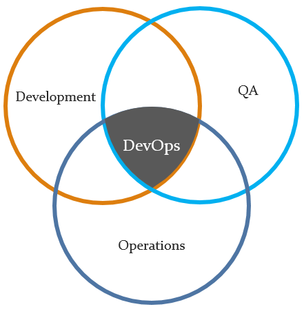

### 1.2. DevOps 的目标

* 快速开发
* 快速质量保证
* 快速部署
* 更快的上市时间
* 迭代和持续反馈（产品所有者，开发，质量保证，生产工程师及最终用户和客户这些利益相关者之间的强而持续的沟通）

### 1.3. DevOps 的好处

* **环境稳定**

  *增强一致性，郑家正常运行时间*
* **更短的开发周期**

  *管理需求和代码仓库*
* **提高发布速度**

  *持续构建，一键式发布*
* **减少缺陷**

  *严格一致的流程，自动化测试*
* **处理指标**

  *跟踪每个阶段的实践以及错误和异常*

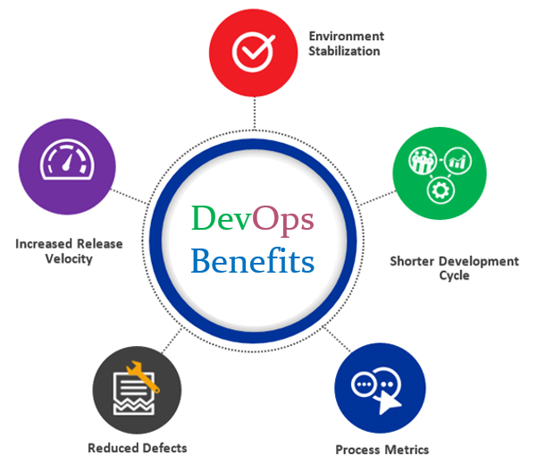

### 1.4. DevOps 的步骤

* **Plan**：任务管理，时间表
* **Code**：代码开发和代码审查，源代码管理工具，代码合并
* **Build**：持续集成工具，版本控制工具，构建状态
* **Test**：持续测试工具，可提供有关业务风险的反馈，确定绩效
* **Package**：工件仓库, 应用程序预部署阶段
* **Release**：变更管理，发布批准，发布自动化
* **Operate**：基础设施安装，基础设施更改（可伸缩性），基础设施配置和管理，基础设施作为代码工具，容量规划，容量和资源管理，安全检查，服务部署，高可用性，数据恢复，日志/备份管理，数据库管理
* **Monitor**：服务性能监控，日志监控，最终用户体验，事件管理

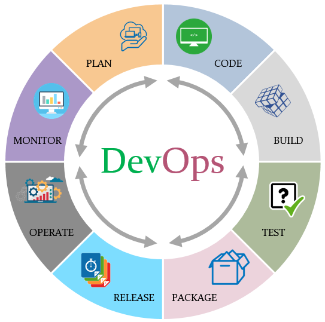

### 1.5. 敏捷 DevOps 流程

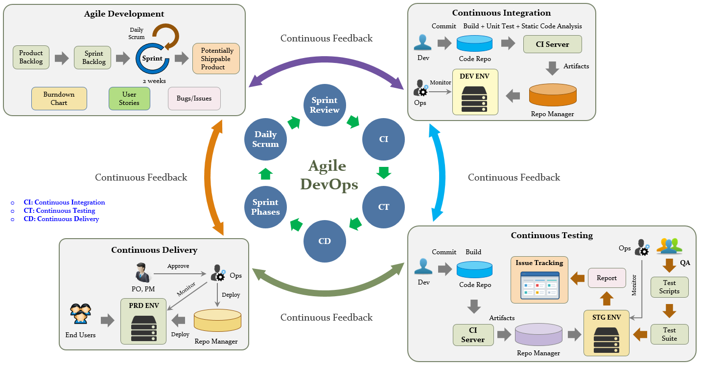

# 2. DevOps 技术

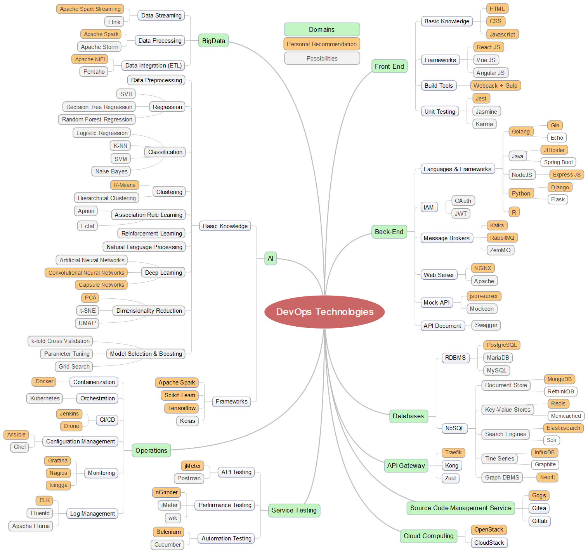

## DevOps 开发人员线路图

* **步骤 1**：学一门语言
    * 从 HTML & CSS 开始
    * 学习 JavaScript 的基础
    * 了解 TypeScript

  ***参考:***
  https://github.com/leonardomso/33-js-concepts

* **步骤 2**：学习代码管理 (推荐使用 Git)

  ***参考:***
  https://github.com/k88hudson/git-flight-rules

* **步骤 3**：对学过的内容动手操作

* **步骤 4**：学习包管理器

* **步骤 5**：学习单元测试

* **步骤 6**：学习数据库 (RDBMS & NoSQL)

* **步骤 7**：学习框架

* **步骤 8**：学习如何实现缓存
    * Redis
    * Memcached

* **步骤 9**：学习创建 RESTful APIs

* **步骤 10**：了解不同的身份验证/授权方法

* **步骤 11**：了解消息中间件
    * NSQ
    * Kafka
    * RabbitMQ
    * ZeroMQ

* **步骤 12**：学习使用 Docker

* **步骤 13**：学习 Web 服务器知识

* **步骤 14**：了解如何测试 service
    * API 测试
    * 性能测试
    * 安全测试
    * 自动化测试

* **步骤 15**：学习不同的协议
    * TCP/UDP
    * Web Socket
    * AMQP
    * MQTT
    * Protocol Buffers
    * gRPC

* **步骤 16**：学习微服务，事件驱动，Lambda 架构

* **步骤 17**：了解大数据技术/工具

* **步骤 18**：学习算法

  ***参考:***
  https://github.com/TheAlgorithms/Python

* **步骤 19**：了解 AI 技术

* **步骤 20**：了解配置，部署服务

* **步骤 21**：了解如何监控

* **步骤 22**：使用开源工具
  * Mock REST APIs：
  https://github.com/typicode/json-server 

  * UML Designer:
  https://www.modelio.org

  * Planning：
  https://wiki.gnome.org/Apps/Planner

  * MindMap：MindMaple Lite

  * UI Wireframe：Pencil (https://pencil.evolus.vn), Balsamiq

  * Windows 上的 SSH 客户端：SuperPuTTY

* **步骤 23**：保持探索精神

## 3. 大数据
### 3.1. 什么是大数据？
**大型数据**的集合，因此无法通过传统方法进行处理...

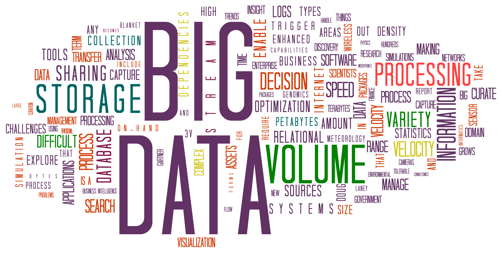

**[源]**：https://topics.amcham.com.tw/wp-content/uploads/2016/03/BigData_2267x1146_white.png

### 3.2. 大数据的特征
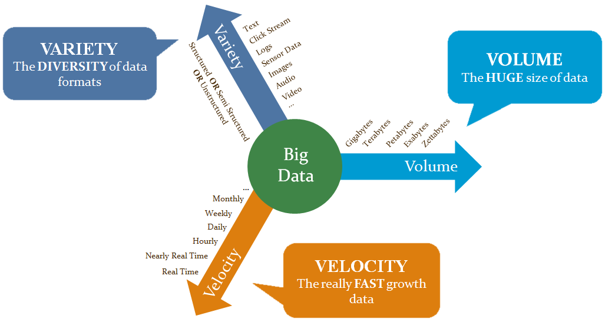

### 3.3. 大数据应用
* 推荐系统
* 点击流分析
* 实时分析
* 情绪分析
* 聚集分析
* 搜索
* 客户细分
* 欺诈检测/预防
* 物联网
* 图像分类
* 异常检测

### 3.4. 大数据解决方案
* **分布式文件系统**

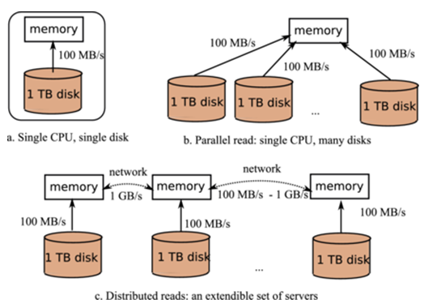

* **分布式数据库**

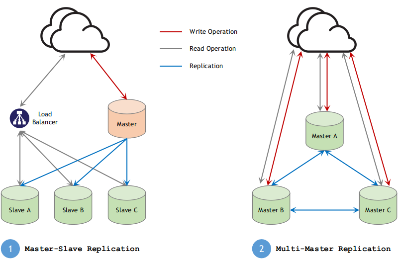

* **分布式计算**

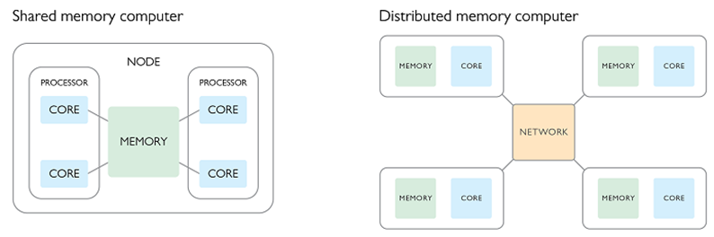

### 3.5. 大数据分析如何工作？
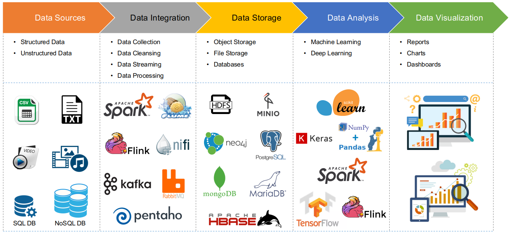

### 3.6. 工作原理
* 数据通常从一个应用程序流到另一个应用程序。 它由一个应用程序生成，并由一个或多个其他应用程序使用。
* 通常，将应用程序 **生成** 或 **发送** 数据称为 **生产者**，而一个 **接收** 数据称为 **消费者**。
* 从一个应用程序向另一个应用程序发送数据的一种简单方法是直接将它们彼此连接。但是，生产者和消费者之间的紧密联系要求它们同时运行或实施复杂的缓冲机制。因此，**生产者与消费者之间的直接联系无法扩展**。

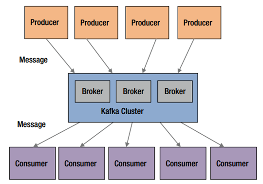

**[源]**：Apache Kafka

一个 **灵活**和 **可扩展** 的解决方案是使用 **消息中间件** 或 **消息系统**。 它们不是连接到彼此直接连接的应用程序，而是连接到消息代理或消息传递系统。这种体系结构使添加生产者或使用者到数据管道变得容易。

### 3.7. 批处理 vs 流处理
* **批处理**\
  在批处理中，新到达的数据元素被收集到一个组中。然后在将来的某个时间对整个组进行处理（因此称为“批处理”）。可以通过多种方式确定每个组的确切处理时间，例如，可以基于计划的时间间隔（**例如**，每五分钟，处理收集到的新数据）或某种触发条件（例如，一旦包含五个数据元素或具有超过 1MB 的数据，就立即处理该组）。

  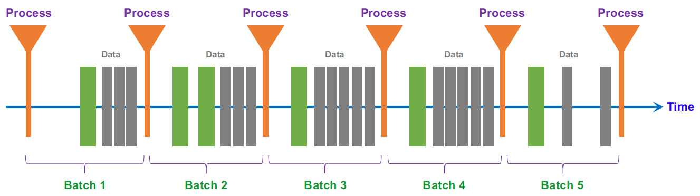

  **微批处理** 经常用于描述小批处理和/或小批处理的情况。 即使处理可能每隔几分钟发生一次，但仍一次处理一批数据。

* **流处理**\
  在流处理中，每个新数据到达时都会进行处理。与批处理不同，不必等到下一个批处理间隔，并且数据将作为单个数据块进行处理，而不是一次进行批处理。

  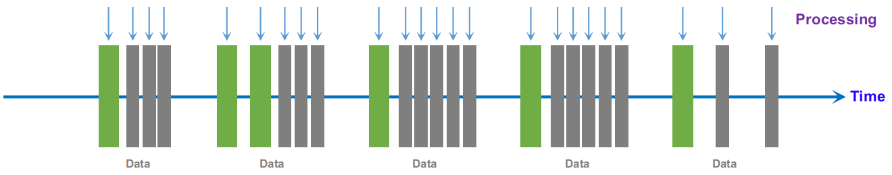

**使用场景**
* 算法交易，股票市场监控
* 监控生产线
* 入侵，监视和欺诈检测
* 预测性维护（例如用于预测性维护的机器学习技术）

**批处理 vs 流处理**

| | 批处理 | 流处理 |
|-|-|-|
| **数据范围** | 查询或处理数据集中的全部或大部分数据 | 在滚动时间窗口内或仅对最新数据记录进行查询或处理数据 |
| **数据大小** | 大量数据 | 单个记录或由几个记录组成的微型批次|
| **性能** | 需要几分钟到几小时 | 需要几秒钟或几毫秒 |
| **分析** | 复杂分析 | 简单的响应功能，汇总和滚动指标 |

**有关更多详细信息，请查看此仓库*：https://github.com/raycad/stream-processing

## 4. 机器学习
### 4.1. 社么是机器学习？
* 机器学习正在创建和使用从数据中学习的模型。
* 机器学习称为预测建模或数据挖掘。

    **例子**：
     * 垃圾邮件预测
     * 欺诈性信用卡交易预测
     * 产品或广告推荐引擎

**数据科学领域**

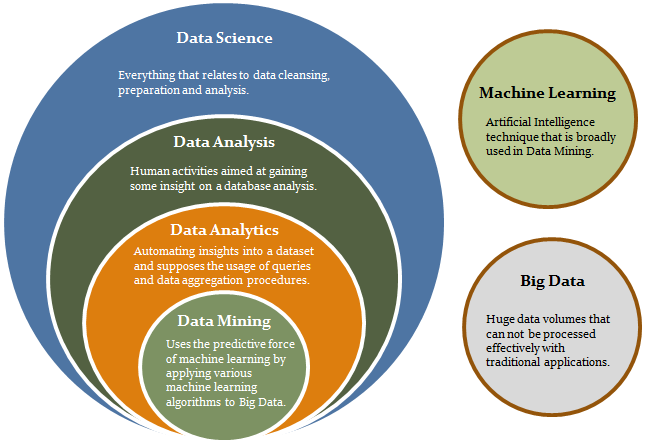

### 4.2. 传统编程与机器学习
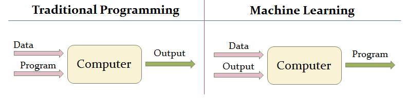

### 4.3. 机器学习过程
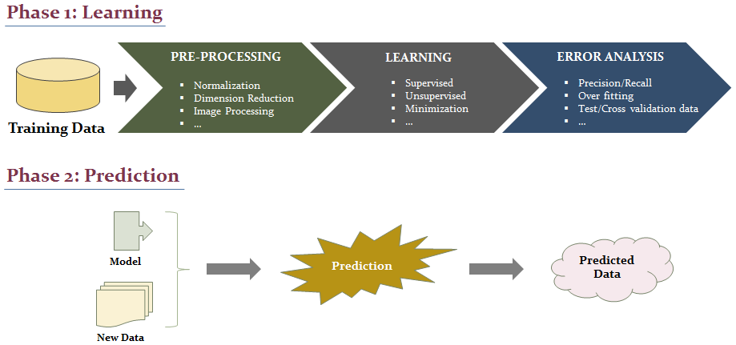

* **模型反馈回路**

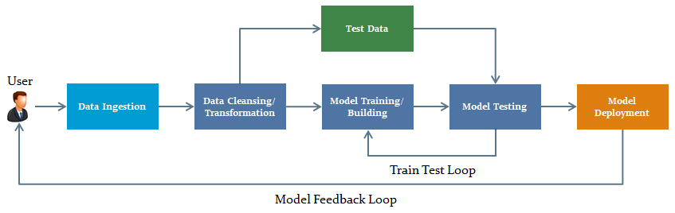

* **深度学习模型构建/部署**

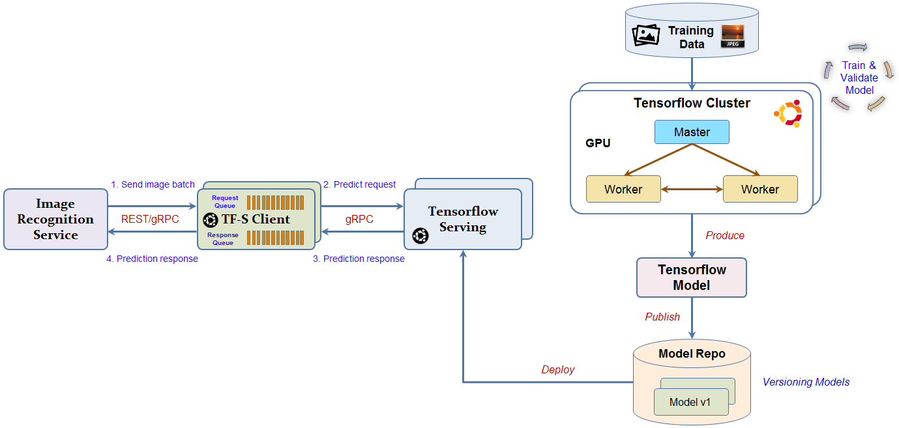

# 5. 书籍推荐
* **2018年Amazon计算机神经网络最畅销书**：*上手 Scikit-Learn 和 TensorFlow 进行机器学习* https://github.com/raycad/devops-roadmap/blob/master/books/ai/ml/hands_on_machine_learning_with_scikit_learn_and_tensorflow.pdf

* **系统设计入门**：https://github.com/raycad/devops-roadmap/blob/master/books/software-architecture/system_design_primer.pdf

* **集体智能编程**：https://github.com/raycad/devops-roadmap/blob/master/books/ai/ml/oreilly_programming_collective_intelligence_aug_2007.pdf

* **Azure 云架构**：https://github.com/raycad/devops-roadmap/blob/master/books/software-architecture/azure_cloud_architecture.pdf

# 6. 参考

https://github.com/raycad/stream-processing

https://codeburst.io/the-2018-web-developer-roadmap-826b1b806e8d
