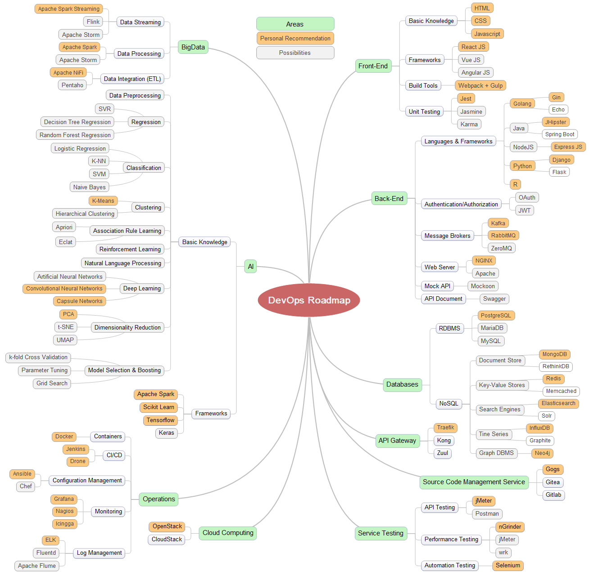
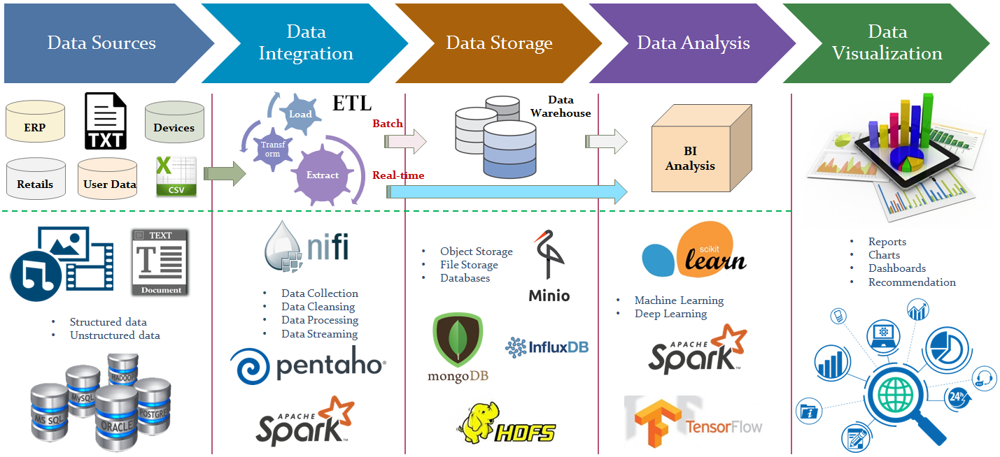

# DevOps Roadmap 2019

For the **beginners** you can refer this article:

*https://codeburst.io/the-2018-web-developer-roadmap-826b1b806e8d*

Below, I'd like to give the **advanced** roadmap based on the **trending**, **performance** and **my experience**:

## 1. Become a Web Developer
* **Step 1**: Learn a language
    * Begin with HTML & CSS
    * Learn basics of the JavaScript 
    * Understand TypeScript

  ***Reference:***
  https://github.com/leonardomso/33-js-concepts

* **Step 2**: Learn about source code management (recommend using Git)

  ***Reference:***
  https://github.com/k88hudson/git-flight-rules

* **Step 3**: Practice what you have learnt

* **Step 4**: Learn Package Manager

* **Step 5**: Learn about Unit Testing

* **Step 6**: Learn about databases (RDBMS & NoSQL)

* **Step 7**: Learn frameworks

* **Step 8**: Learn how to implement caching
    * Redis
    * Memcached

* **Step 9**: Creating RESTful APIs

* **Step 10**: Learn about different Authentication/Authorization methods

* **Step 11**: Understand Message Brokers
    * NSQ
    * Kafka
    * RabbitMQ
    * ZeroMQ

* **Step 12**: Learn how to use Docker

* **Step 13**: Knowledge of Web Servers

* **Step 14**: Learn how to test service
    * Test API
    * Test Performance
    * Test Security
    * Test Automation

* **Step 15**: Learn different protocols
    * TCP/UDP
    * Web Socket
    * AMQP
    * MQTT
    * Protocol Buffers
    * gRPC

* **Step 16**: Learn Microservice, Event Driven, Lambda architectures

* **Step 17**: Learn Big Data technologies/tools

* **Step 18**: Learn algorithms

  ***Reference:***
  https://github.com/TheAlgorithms/Python

* **Step 19**: Learn AI technologies

* **Step 20**: Learn configuration/deployment services

* **Step 21**: Learn how to monitor services

* **Step 22**: Use open source tools
  * Mock REST APIs: 
  https://github.com/typicode/json-server 

  * UML Designer:
  https://www.modelio.org

  * Planning: 
  https://wiki.gnome.org/Apps/Planner

  * MindMap: MindMaple Lite

  * UI Wireframe: Pencil (https://pencil.evolus.vn), Balsamiq

  * SSH clients for Windows: SuperPuTTY

* **Step 23**: Keep exploring

## 2. Think about Big Data problems and find out solutions to solve them
### 2.1. What is Big Data?
A collection of **LARGE Datasets**, so it can **NOT be Processed** by traditional methods…

**[Source]**: https://topics.amcham.com.tw/wp-content/uploads/2016/03/BigData_2267x1146_white.png

### 2.2. Characteristics of Big Data

### 2.3. Big Data Use Cases
* Recommendation System
* Clickstream Analysis
* Real-time Analytics
* Sentiment Analysis
* Clustering Analysis
* Search
* Customer Segmentation
* Fraud Detection/Prevention
* Internet of Things
* Image Classification
* Anomaly Detection

### 2.4. Big Data Solutions
* <H3>Distributed File System</H3>

* <H3>Distributed Database</H3>

* <H3>Distributed Computation</H3>

### 2.5. How Does Big Data Analysis Work?

### 2.6. Why Messing?
* Data usually flows from one application to another. It is produced by one application and used by one or more other applications. 
* Generally, the application **generating** or **sending** data is referred to as a **producer**, and the one **receiving** data is called a **consumer**.
* A simple way to send data from one application to another is to connect them to each other directly. However, tight coupling between producers and consumers requires them to be run at the same time or to implement a complex buffering mechanism. Therefore, **direct connections between producers and consumers does not scale**.

**[Source]**: Apache Kafka

A **flexible** and **scalable** solution is to use a **message broker** or **messaging system**. Instead of applications connecting directly to each other, they connect to a message broker or a messaging system. This architecture makes it easy to add producers or consumers to a data pipeline.

### 2.7. What is Batch/Stream Processing?
* Batch processing is processing  a large volume of data at once.

  **Example** *processing  all the transactions that have been performed by a major ecommerce firm in a week. This data can tune into millions of records for a day which can be stored as a file/records etc. This particular file will undergo processing at the end of the day for various analysis the company wants to do and naturally it will take large amount of time for this to be processed. That would be what Batch processing is. And what Hadoop does is it provides Map Reduce as a processing tool for these large files which can be years of data stored monthly of data etc.*

* Stream processing changes the approach for processing. What it does is it applies the business logic to every transaction that is being recorded for the above ecommerce portal. It applies business logic to every event that is being captured rather than store all the events and then process them, which turns out now that whatever analysis is being done reflects the real state of the data at this instance. So, it becomes real time. And therefore stream processing is also associated with Real time.

<H3>Batch Processing vs Streaming Processing</H3>

| | Batch Processing | Stream Processing |
|-|-|-|
| **Data Scope** | Queries or processing over all or most of the data in the dataset | Queries or processing over data within a rolling time window, or on just the most recent data record |
| **Data Size** | Large batches of data | Individual records or micro batches consisting of a few records |
| **Performance** | Latencies in minutes to hours | Requires latency in the order of seconds or milliseconds |
| **Analyses** | Complex analytics | Simple response functions, aggregates, and rolling metrics |

## 3. Apply Machine Learning technologies to mine data
### 3.1. What is Machine Learning?
* Machine learning is creating and using models that are learned from data.
* Machine learning referred to as predictive modeling or data mining.

    **Examples**:
     * Spam prediction
     * Fraudulent credit card transaction prediction
     * A product or advertisement recommendation engine

<H3>Data Science Fields</H3>

### 3.2. Traditional Programming vs Machine Learning

### 3.3. Machine Learning: Process

* <H3>Model Feedback Loop</H3>

* <H3>Deep Learning Model Build/Deployment</H3>

## 4. Books Recommendation

## 5. References
https://github.com/josephmisiti/awesome-machine-learning

https://github.com/ujjwalkarn/Machine-Learning-Tutorials

https://codeburst.io/the-2018-web-developer-roadmap-826b1b806e8d

https://medium.com/level-up-web/developer-roadmaps-all-in-one-place-75c0402db0e0

https://medium.com/tech-tajawal/modern-backend-developer-in-2018-6b3f7b5f8b9

https://www.svds.com/open-source-toolkits-speech-recognition

https://github.com/Microsoft/CNTK